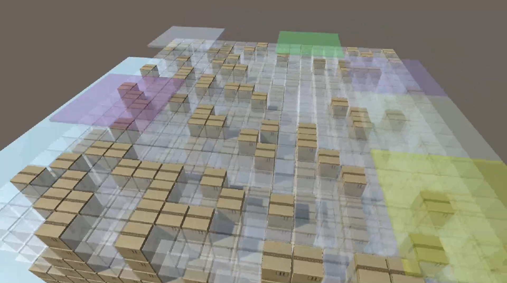

# Q Learning Release Notes 27.04.2024

- [Q Learning Release Notes 27.04.2024](#q-learning-release-notes-27042024)
- [Application of Stage 2](#application-of-stage-2)
  - [Penalize moves that prevents further movement](#penalize-moves-that-prevents-further-movement)
    - [Example 1](#example-1)
    - [Example 2](#example-2)
    - [Final Example](#final-example)
  - [Optimization of Path Clearance for Selected Boxes](#optimization-of-path-clearance-for-selected-boxes)
  - [Example Demonstrating Box Clearance Strategies](#example-demonstrating-box-clearance-strategies)
- [Design and Implementation of Stage 3](#design-and-implementation-of-stage-3)
  - [Visualization of Agents](#visualization-of-agents)
  - [Agent Features](#agent-features)
    - [Area Restrictions](#area-restrictions)
  - [Agent Class](#agent-class)
  - [Agent Default Behaviors](#agent-default-behaviors)
  - [Q-Learning Model for Agent Summoning Decision](#q-learning-model-for-agent-summoning-decision)
    - [Q-Table Structure](#q-table-structure)
    - [Learning and Reward Mechanism](#learning-and-reward-mechanism)
    - [Updating the Q-Values](#updating-the-q-values)
  - [Decision Model for Assigning Tasks to Local Agents](#decision-model-for-assigning-tasks-to-local-agents)
    - [Structure of the Local Q-Table](#structure-of-the-local-q-table)
    - [Initialization and Update of Q-Values](#initialization-and-update-of-q-values)
    - [Reinforcement Criteria](#reinforcement-criteria)
    - [Implementation and Effectiveness](#implementation-and-effectiveness)
    - [Example Uses Both Models](#example-uses-both-models)
  - [Final Example](#final-example-1)
  - [Future Implementations](#future-implementations)

In this latest release of our ongoing Q Learning project, we present the completion of Stage 2 and the introduction of Stage 3. This document outlines significant advancements in our machine learning strategies, specifically focusing on the application of series of singular commands, a concept we explained in our previous release. Furthermore, we delve into the newly initiated Stage 3, which explores the logic and application of swarm intelligence behavior among agents, marking a significant advancement in our project's trajectory towards more complex and collaborative AI functionalities.

**Please note that** the videos or images presented in this document may have different features, both logical and visual, as this release covers developments over the span of one month.

# Application of Stage 2

In the previous release, we mainly discussed the box clearing methodology we developed, which includes its special tree structure, decision making, reward, and learning methods. There were two important points about that. First, we implemented a system to penalize each branch of the tree slightly when the end point move was tried for the first time. This approach enables the selection of the least time-consuming solution. Moreover, we noted that when a move is penalized or rewarded, it's all branch up to the root are also rewarded or penalized in specified proportions.

Secondly, we imposed heavier penalties on moves, and consequently their branches, that prevent the movement of boxes. This includes any movement needed, whether it is a box being carried (red) or boxes above the box being carried. This method ensures a streamlined box clearing strategy that avoids clogging pathways, considering future decisions and updating the Q-tree in real-time.

Thirdly, in this release, we implemented a timeout penalty for the amount of boxes to be replaced during box clearing, which actually equals to the length of the branch. This prevents potential significant time loss or even stucks at the beginning of Q learning, where random selection is more prevalent.

As we already looked in previous notes, the first that is penalizing every move slightly, we will mainly focus on the moves that clog the further movement, that is the second.

## Penalize moves that prevents further movement

We penalize the moves that clog further movements in different degrees, whether they clog the red box (most severe) or the boxes that need to be cleared (least severe). In this way, we ensure an unclogged pathway for our boxes that need to be repositioned.

**Important to know that** we still use only one agent in this phase. We will extend our agent amount in the 3rd stage.

### Example 1
In the example below, two boxes are commanded to go to specific positions in series. 
In episode one, the box above the first box is cleared in a way that it is pushed to the second box's position above. This means it will also be repositioned when it is the second box's turn because it clogged the second box's path. Thus, though these two boxes will eventually be carried, overall movement requires more time and effort.

      
      
<em>Episode 1: Initial repositioning complicates movement</em>

  

In the second episode, the agent has learned from the first episode not to carry the box above the second box. Applying this lesson ensures a clear pathway for the second box, thereby saving time.

      
      
<em>Episode 2: Improved strategy after learning</em>

  

### Example 2
In our second example, the selected box is commanded to go to the designated place. Unfortunately, the box above is repositioned exactly to where our targeted box needs to go. This movement of the box above is penalized heavily. The problem is initially presented in Episode 1 and subsequently solved in Episode 2 by changing the box clearing pattern, demonstrating the learning and adjustment capabilities of the agent.

      
      
<em>Episodes 1 and 2: Problematic repositioning and subsequent solution</em>

  

### Final Example

Below is shown the final episodes after it has been settled according to the criterion from Stage 1 and Stage 2. You can observe that three boxes are commanded in series and are moved in order in the most efficient way learned.

      
      
<em>Final Example: Efficient Serial Movement of Boxes</em>

  

## Optimization of Path Clearance for Selected Boxes

When a designated "selected" (red) box encounters an obstruction, the repositioning of this obstruction is addressed at the start of subsequent episodes. This response follows the box clearing rules introduced in Stage 2, focusing on efficiency and timing. Importantly, this prioritization is exclusive to selected boxes, not extending to boxes that cause blockages, as including these could overly complicate the scenario and other boxes may find alternative routes, reducing the severity of the obstruction.

Additionally, if the path of the selected box is altered such that it no longer passes the obstructed area (as per the strategies from Stage 1), repositioning of the obstruction becomes unnecessary and can be canceled in future episodes. This change reflects a dynamic adjustment to ensure efficient path clearance without unnecessary interventions.

**Note that** thought the logic is similar, this is slightly different from local box clearing mentioned in earlier stage 2, which was aiming to clear the boxes above selected boxes. Here we develop a clearing strategy of major obstructions in front of selected boxes, **feeding the total result back** including which path is preferred in stage 1 and how the total efficiency result in stage 1 and 2 could be maximized here, which was not important in local box clearing.

## Example Demonstrating Box Clearance Strategies
Below is a detailed example about how the agent deals with such conditions in episodes, using the concept explained above. 

**Episode 1:**  
The selected box encounters multiple blockages at a critical point, making entry impossible without clearing these obstacles.

      
      
<em>Episode 1: Multiple Blockages</em>

  

**Episode 2:**  
At the start of this episode, a box identified as a blocker in Episode 1 is strategically repositioned. The agent performs seven side steps in total: one to pick up the box and **six to reposition other boxes.**

      
      
<em>Episode 2: Repositioning Blockers</em>

  

**Episode 3:**  
A more efficient method to clear the path for the selected box is discovered, for blockage to clear, requiring only one side step and one downward step, compared to two side steps and one downward step in Episode 2. This pattern aligns well with the objectives of Stage 1, making this method of clearing the default approach.
Seven side steps are performed by the agent in total here: two to pick up the box and **five to reposition the other boxes.**

      
      
<em>Episode 3: Improved Efficiency in Clearing</em>

  

**Note on Agent Repositioning Time:**  
The time an agent spends repositioning itself over the boxes (pick time) is not a focal point, as command sequences will be executed simultaneously by multiple agents in stage 3, nullifying this time gap. Instead, our algorithm now prioritizes reducing the steps an agent must take during delivery by employing Stage 2's box clearing methods, resulting in more efficient outcomes in scenarios with multiple agents.

**Thus, because steps for boxes to reposition is decreased from 6 to 5, episode 3 will be more advantageous.**

# Design and Implementation of Stage 3

In Stage 3, we have decided to design and implement swarm intelligence. Since a single agent may be insufficient to execute commands across a larger map, we are transitioning to using multiple agents. These agents will work on series commands together, enhancing efficiency and coverage.

## Visualization of Agents

To visualize agents on the box, we used colored planes. **Their opacity are decreased when they carry boxes in real time** for better visualization clarity. Additionally, we structured the simulation space as 20x10x20 to better design and simulate activities on the road. Agents are created randomly within this setting, similar to placing a random number of robots in random locations across the area. The image below shows the agents and the map.

      
      
<em>Visualization of Agents and Map</em>

  

## Agent Features

- **Scope of Vision**: Each agent has a dynamic scope of vision, limited to the area marked by their colored plane, making their perception local.
- **Knowledge Base**: All agents have access to the entirety of the Q table and Q trees from Stages 1 and 2, enabling them to operate effectively in any learned environment.
- **Mobility and Tasks**: Agents can move freely, either carrying boxes or being directed to specific areas by the global brain.
- **Restricted Work Areas**: The global brain can define restricted areas for agents, ensuring they do not leave designated work zones. This is crucial when the work density is uniform across the plane.
- **Dynamic Allocation**: The global brain can summon the nearest agents to a work location based on the difficulty or complexity of the task. This feature ensures optimal resource utilization.

The animation below demonstrates how the global brain summons the closest agents to the workplace:

      
      
<em>Global Brain Coordinating Agents</em>

  

### Area Restrictions
In the scenario depicted below, the global brain has set restrictions on the movement areas of the agents. As a result, one agent must hand over its box to another during the task, demonstrating a dynamic and coordinated approach to managing spatial constraints within the operational environment.

      
      
<em>Agent Task Handover Due to Restricted Movement Areas</em>

  

## Agent Class

## Agent Default Behaviors

If the Q-learned material does not provide specific rules or the global brain does not intervene, agents will follow their default behaviors. These behaviors include:
- **Scope Vision**: Agents will observe their immediate area.
- **Initiative**: Agents have the capability to initiate the movement of any box within their scope.
- **Following**: Agents will follow the box they are tasked with moving; their actual position is **directly above the box** they are carrying, and **the middle of the scope** at the end of move.
- **Task Allocation**: If two agents are positioned above a box that needs to be moved, the closest one will take on the task.

The video below demonstrates these default behaviors in action:

      
      
<em>Demonstration of Agent Default Behaviors</em>

  

## Q-Learning Model for Agent Summoning Decision

In Stage 3, the global brain utilizes a Q-learning model to dynamically determine the optimal number of agents to summon for a task. The decision-making process is guided by several factors, reflecting the complexity of operations and the need for efficient resource allocation in real-time. Here's how the Q-learning model is structured and operates:

### Q-Table Structure
- **States**: Each state in the Q-table represents the 3D grid position of the selected box around which the task is centered. This allows the global brain to evaluate the geometric requirements and constraints specific to each task's location.
- **Actions**: Each action reflects a floating-point value indicating the "agent need" — essentially how many agents the global brain considers necessary for optimal task performance. The rounded value of this number determines how many agents will be summoned. For example, if it is 1.6 then 2 agents will be summoned.

### Learning and Reward Mechanism
The Q-learning process adjusts the agent need values based on the outcomes and efficiencies of completed tasks, using the following reward structure:

1. **Negative Reward for Inefficient Agent Utilization**:
   - If agents are summoned but not used effectively, indicating an overestimation of necessary resources, the reward is negatively adjusted. This adjustment is inversely proportional to the duration of simultaneous work, reducing the agent need value in similar future states to prevent resource wastage.

2. **Adjustment Based on Work Intensity**:
   - **Calculation of Work Intensity**: The average work intensity for each task is calculated by evaluating how much each agent contributes within the time spent. This intensity is determined by dividing the total boxes moved by the total time taken, averaged across the agents involved. For example, if the 1st agent carries 3 boxes and the 2nd agent carries 5 boxes in a total of 12 seconds, the average work intensity would be calculated as `(3/12 + 5/12)/2 = 0.333`.

   - **Comparison Across Episodes**: This calculated intensity is then used to assess the efficiency of task execution over different episodes. If the task can be performed in 9 seconds instead of 12, with the same number of boxes moved, the ideal work intensity would increase to `(3/9 + 5/9)/2 = 0.444`, reflecting a more efficient use of agent time and effort.

   - **Effect of Adding an Agent**: If a third agent is added and it carries 2 additional boxes, making the total 10 boxes moved in 9 seconds by 3 agents, the new average work intensity becomes `(3+5+2)/9/3 = 0.37`. This intensity is compared to the previous episodes' intensities to determine efficiency gains or losses. Here, the new intensity of 0.37 shows a decrease.

   - **Reward Adjustment**: Rewards are adjusted based on these intensity calculations. The goal is to maintain an optimal intensity interval where efficiency is maximized without overloading the agents. A positive reward is given if the work intensity stays within this optimal range, suggesting that agent resources are being used effectively. Conversely, a negative reward is applied if the work intensity falls outside this range, indicating less efficient use of resources or potential overload.

This method ensures that the deployment of agents is continuously optimized based on actual performance data, promoting the most efficient and effective strategies for future tasks.

1. **Negative Reward for Travel Distance**:
   - A negative reward proportional to the distance an agent must travel to reach the work site is assigned. This factor discourages the unnecessary movement of agents across large distances, promoting local resource utilization and reducing time delays.

2. **Future Enhancements**:
   - Additional considerations, such as whether an agent has pending tasks near its current location, might be incorporated to refine the decision-making process further. Agents with imminent nearby tasks could be flagged as less desirable for summoning to distant locations, optimizing overall system efficiency.

### Updating the Q-Values
The Q-values are updated using the standard Q-learning formula at the end of each episode. The formula incorporates the observed rewards and the discounted maximum future rewards, thus continuously refining the global brain's strategy based on new data and outcomes.

This Q-learning framework ensures that the global brain's decisions are adaptive, based on both the immediate results of agent deployment and the broader patterns observed over time. This approach optimizes resource allocation, minimizes idle time, and enhances the overall efficiency of the multi-agent system in dynamic environments.

## Decision Model for Assigning Tasks to Local Agents

After the agent summoning process is complete, the next critical decision in the workflow is determining which box should be handled by which agent within the work group at the task site. This decision-making is facilitated through a localized Q-learning model specific to each workplace.

### Structure of the Local Q-Table

- **States**: Each state in the Q-table represents the positions of the boxes that need to be moved within the workplace.
- **Actions**: Actions are defined as the offer values provided by each potential agent for carrying a particular box. These values represent the agents' proposals to take responsibility for moving the box, factoring in their current position, previous tasks, and other relevant criteria.

### Initialization and Update of Q-Values

- **Initialization**: Initially, the Q-table sets the highest value for the agent closest to each box, as proximity is a primary factor in determining task allocation. This default setting persists until it is overridden by learned values based on actual task execution outcomes.
- **Updates Through Learning**: Each agent's offer for a box is dynamically updated based on the results of task executions, utilizing a mix of exploration of new strategies and exploitation of known efficient strategies. The Q-values are adjusted at the end of each episode based on several reinforcement signals:

### Reinforcement Criteria

1. **Proximity Bonus**: A box offer is positively reinforced if the box is closer to the agent, reducing the time and effort needed for the agent to commence the task.
2. **Recency Bonus**: Strong positive reinforcement is applied if the box was recently moved by the agent, encouraging the agents to continue the work they started.
3. **Column Constraint**: Negative reinforcement is given if the box is in the same column where the agent recently worked, encouraging spatial diversification in task assignments to avoid redundant movements.
4. **Restriction Penalty**: Strong negative reinforcement occurs if the box is outside the restricted movement area for the agent, aligning task assignments with operational boundaries.
5. **Idle Penalty Reversal**: Positive reinforcement is awarded for every box if the agent has been idle for an extended period, encouraging more balanced task distribution among available agents.

### Implementation and Effectiveness

This localized decision model allows for a high degree of specificity in task assignment, tailoring agent actions to the immediate needs of the environment. By continuously learning from each completed task, the system becomes increasingly effective at assigning tasks in a manner that optimizes overall workflow efficiency, reduces agent idle time, and minimizes operational disruptions. This model not only enhances the immediate operational efficiency but also contributes to the long-term adaptability and scalability of agent-based task management systems.

### Example Uses Both Models

In this example, we examine how agents and the global brain operate through three episodes. While Stage 3 is designed for real-time, simultaneous operations fitting their intended use, **this stage is currently not simultaneous**; boxes and agents are moved in sequence.

**Episode 1:**  
The global brain decides to summon 1 agent because no agents are directly above the selected box. This single agent handles the task which involves clearing 2 boxes above the selected box and then carrying the selected box to its destination. **If each move takes 1 second**, the agent spends 11 seconds to clear boxes and 2 seconds to travel to pick up boxes.

      
      
<em>Episode 1: Single Agent Operation</em>

  

**Episode 2:**  
The global brain decides that employing 2 agents could be more efficient for this task. Consequently, one agent clears the boxes while the other carries the selected box afterward. This coordination results in the agents spending 12 seconds on box movement and 1 second to approach the boxes. Because of box clearing strategy difference, there is a net loss of 1 second compared to the first episode where it took 11 seconds for box movement. Thus, the task duration totals 12 seconds.

      
      
<em>Episode 2: Two Agents Collaborating</em>

  

**Episode 3:**  
It is decided to conduct operations simultaneously with 2 agents, ensuring no delays while one works as the others wait. This synchronization eliminates the need for travel time to pick boxes, resulting in a total task time of 11 seconds, which proves to be more efficient than the previous methods.

      
      
<em>Episode 3: Fully Simultaneous Operation</em>

  

## Final Example

We have the final episodes set up here, with 2 boxes selected in series to be moved to their destinations. Agents are represented as rectangles above the simulation, indicating their active participation in the tasks. Initially, the global brain summons the 1st and 2nd agents for the job involving the 1st box. These two agents complete the task without any time spent picking up the boxes, thereby eliminating any timing loss. Subsequently, the 1st and 3rd agents take on the job for the 2nd box in the same efficient manner.

      <video src="img/15.mp4" width="800" controls>
        
Your browser does not support the video tag.

      </video>
      
<em>Final Episode: Efficient Multi-Agent Coordination</em>

  

## Future Implementations

As we progress through Stage 3, the infrastructure necessary to enable boxes to be worked on simultaneously will be fully established, and the final simulations will be tested. This phase is critical to ensuring that all components of the system function cohesively and efficiently in a real-world scenario.

### Completion and Refinement of Stage 3

- **Implementation Completion**: The full implementation of Stage 3 will be finalized, integrating all planned features and functionalities.
- **Debugging and Enhancements**: Following the completion, a thorough debugging process will be carried out to identify and resolve any issues. Additionally, slight enhancements will be made based on initial performance data.

### Advanced Q-Learning Model Development

- **Local Roaming and Situating Model**: If time permits, a new Q-learning model will be developed to enhance agent autonomy. This model will enable agents to roam locally and position themselves in areas where work is likely to occur. This proactive approach aims to reduce response times and improve the overall efficiency of the agent fleet by anticipating where demands will arise based on historical data and predictive analytics.

These future steps are designed to solidify the foundation built in the earlier stages and push the boundaries of what our intelligent systems can achieve in dynamic and complex environments.

