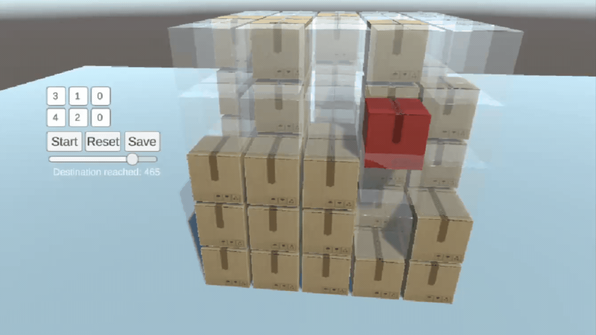

# Q Learning Release Notes 22.03.2024

- [Q Learning Release Notes 22.03.2024](#q-learning-release-notes-22032024)
- [Changes in Stage 1](#changes-in-stage-1)
  - [Explanations of Adjustments](#explanations-of-adjustments)
    - [Descent Penalty Change](#descent-penalty-change)
    - [Penalty for Revisiting Past States Change](#penalty-for-revisiting-past-states-change)
    - [Ascending Reward Change](#ascending-reward-change)
    - [Penalty for Each Step Change](#penalty-for-each-step-change)
  - [Result of Changes in Stage 1](#result-of-changes-in-stage-1)
- [Implementation of Design of Stage 2](#implementation-of-design-of-stage-2)
  - [Box Clearing Mechanism](#box-clearing-mechanism)
    - [Box Clearing Mechanics](#box-clearing-mechanics)
    - [Tree Structure](#tree-structure)
    - [Rewarding, Q Learning, and Decision Process](#rewarding-q-learning-and-decision-process)
    - [Rewarding](#rewarding)
    - [Q Learning and Decision](#q-learning-and-decision)
    - [Series of Singular Commands](#series-of-singular-commands)

# Changes in Stage 1
Refresher: In stage 1, the objective is for a single box to reach a specified point within a 3D grid, following predefined rules, and achieving the goal in the shortest time possible. The Q-table utilized for this stage contains a mapping of states to actions, where each state represents a position within the grid, and each action corresponds to a move the box can make.

The primary objective for the single box in this environment is to ascend to the highest plane and subsequently navigate to the desired column for descent. To ensure optimal performance and adherence to this goal, we  balanced and fine-tuned the reward system. These adjustments were carefully implemented to encourage behaviors that align with the desired outcome while discouraging deviations. Detailed explanations for each modification will be provided later in the documentation, shedding light on the logic behind our decisions and how they contribute to achieving the overarching objective.

| Reward                                | Description                                                                                           | Old Value | New Value | Other Changes           |
|---------------------------------------|-------------------------------------------------------------------------------------------------------|------------|------------|--------------------------|
| Penalty for Each Step                 | A small penalty applied for each move to discourage unnecessary movements.                            | -0.05      | **-0.22**      | -                        |
| Goal Achievement Reward               | The reward received if the box reaches the target point successfully.                                  | 0.2        | 0.2        | -                        |
| Penalty for Inability to Move         | Penalty received when the box cannot move due to obstacles or restrictions.                           | -0.5       | -0.5       | -                        |
| [Ascending Reward](#ascending-reward-change)                      | Reward for successfully ascending while aligning with the x and z coordinates of the starting point. | 1.25       | **1.75**       | -                        |
| [Descent Penalty](#descent-penalty-change)                       | Penalty for descending into a column different from the target x and z coordinates.                   | -2.25      | -2.25      | Removed: Gamma value is not changed anymore.      |
| Penalty for Moving in the Wrong Direction | Penalty received if the box chooses a direction outside the target column despite being in the target column. | -0.75      | -0.75      | -                        |
| [Penalty for Revisiting Past States](#penalty-for-revisiting-past-states-change)   | Penalty received if the agent revisits a state it has visited within the last 8 moves to prevent repetition of states. | -2.0       | -2.0       | Changed: Buffer size increased from 6 to 8 |

## Explanations of Adjustments

### Descent Penalty Change

The condition of resetting gamma to 0 when the box gets stuck at the top has been removed. Such logic didn't conform to Q-Learning principles, and it was observed that the subsequently defined rewards effectively addressed this sticking issue.

### Penalty for Revisiting Past States Change
The size of the state buffer preventing revisits to previously visited boxes has been increased from 6 to 8. This adjustment was made in response to observed instances of being stuck in loops of size 8, and it anticipates the possibility of developing an algorithm to dynamically adjust the buffer size based on the grid dimensions in the future.

### Ascending Reward Change

In some rare instances, situations arose where the agent reached the target without ascending to the highest plane. To mitigate this issue, the reward for ascending was increased from 1.25 to 1.75. Additionally, this adjustment resolved the fundamental problem of reaching the target adjacent to the agent without ascending. The following video provides visual context for the problem has been solved:

      
      
<em>A demonstration showcasing the problem before it has been solved.</em>

  

### Penalty for Each Step Change

In some cases, the penalty applied for each step remained relatively low compared to the newly introduced rewards, which led to instances where the agent would occasionally opt for longer paths, as demonstrated in the following GIF:

  
  
<em>A demonstration showcasing instances where the penalty for each step was insufficient, leading to suboptimal decision-making by the agent.</em>

To ensure balance with the other rewards, the penalty for each step was increased from 0.05 to 0.22. This adjustment aligns the penalty more effectively with the overall reward system, promoting better decision-making by the agent.

## Result of Changes in Stage 1

Following these adjustments and balancing efforts, no major errors have been observed in Stage 1. The fine-tuning of rewards and penalties has effectively mitigated previous issues, leading to improved performance and stability in the environment.

# Implementation of Design of Stage 2 

In this stage, the objective is to teach the algorithm to execute a series of singular commands implemented in Stage 1, guiding multiple boxes to their respective desired locations in sequential order. It's important to note that the learning process for each individual command can influence the execution of others in the series. 

At the core of Stage 2 is the implementation of box clearing mechanics, which involves another Q-learning process distinct from Stage 1. This process focuses on repositioning the boxes based on two primary criteria:

1. **Boxes Placed Above Our Box:** The algorithm aims to clear boxes positioned above our target box to create a clear path for its movement.

2. **Boxes Blocking Our Box's Route:** Additionally, the algorithm targets boxes obstructing the route of our target box, ensuring unobstructed progress towards its destination to achieve the best results in Stage 1.

## Box Clearing Mechanism

We initially established the mechanics of box clearing, outlining the process for repositioning boxes to facilitate unobstructed movement of the target box. With this infrastructure in place, we proceeded with two main steps: Initially, we implemented a method to randomly change the positions of boxes that were located above our target box within the scope of defined mechanics. This step aimed to create initial conditions for the box clearing process.

Following the random repositioning step, we designed and integrated a new Q-learning logic specifically tailored to train boxes to be repositioned in the most optimal and logical manner. This involved designing reward structures and updating Q-Values to encourage behaviors that facilitated efficient box clearing.

### Box Clearing Mechanics

In this stage, the box clearing mechanics involve repositioning a box on top of our target box by moving it one block in the xz plane and descending if the space below is available. If the intended repositioning spot is occupied, the box currently occupying that space must also be repositioned. Additionally, if there are boxes above the intended repositioning spot, they must also be moved accordingly. This infrastructure is designed to be logical and realistic, mirroring real-life scenarios.

Below video illustrates how boxes will be cleared above the randomly selected box:

  
  
<em>A demonstration showcasing the process of clearing boxes above the randomly selected box.</em>

*Note: Stage 1's logic and rules will be implemented for each box to be repositioned in the application. However, for the infrastructure of further development, the current setup is sufficient for now.*

### Tree Structure

In our approach to box clearing mechanics, we aim for the agent to learn these mechanics rather than relying on random actions. To achieve this, we've introduced a QTree instead of a QTable. This QTree represents action chains, as mentioned in the previous section, from the root to the endpoint.

At the root of the QTree is the box that needs to be repositioned first, such as the box above our target box. Subsequent boxes that are repositioned and the target space are children in a chain-like manner, similar to a tree structure in data structures. Each node in the QTree contains the following information:

- **Position Information:** The position of the box (Vector3Int state).
- **Q-Value:** The Q-value associated with that position.
- **Children:** A list of QTreeNodes representing subsequent nodes that are possible actions from that position.
- **Parent:** The parent node in the QTree.

This hierarchical structure allows for a more organized representation of the possible actions and their associated Q-values, facilitating more efficient learning and decision-making by the agent.

Furthermore, each QTree is added to a list of QTrees, ensuring that they are all organized and accessible for learning and decision-making processes by the agent.

### Rewarding, Q Learning, and Decision Process

In our system, we have a method to reward a node's Q-value and its entire parent chain in a tree-like manner. This means that when a node is rewarded or penalized, the effects propagate through its branch in the tree. Specifically, if a node receives a reward or penalty, all nodes along its branch are similarly encouraged or discouraged, respectively but in different portions. 

This approach ensures that actions leading to positive outcomes are reinforced throughout the entire chain of actions, while actions leading to negative outcomes are discouraged. By considering the entire branch, the agent can make more informed decisions, as each action's consequences are evaluated within the context of its broader trajectory.

### Rewarding

In our system, we have currently two main rules for rewarding:

1. **Penalty for Each Step in Branches:** Initially, for each branch in the first instance created in runtime, we penalize the endpoint child node and its entire branch in a manner similar to the "Penalty for Each Step" in Stage 1. This strategy encourages the exploration of the quickest and most effortless branches, as the penalty discourages unnecessary actions and promotes efficiency.

2. **Penalizing Blocking Nodes:** Additionally, if any box obstructs the path of any of our target boxes in a series of singular commands, after the box clearing process, the node responsible for the obstruction and its entire branch are penalized when a target box is blocked at runtime. This penalization ensures that actions leading to blocked paths are discouraged, encouraging the agent to avoid similar situations in the future.

### Q Learning and Decision

After receiving a reward, the Q-value for the endpoint and its branch members is determined using the classical Q-learning formula. We use an alpha value of 0.5, similar to Stage 1, and set gamma to 0 for now.

In this process, each node evaluates its potential actions based on their Q-values. The node selects the child with the highest Q-value to proceed and complete the action. This approach ensures that the agent chooses actions that are likely to yield the highest rewards according to its learned knowledge.

Furthermore, each tree in our system has a decaying epsilon value over time. This epsilon value determines the likelihood of selecting a child node based on its Q-value or randomly. If the node does not have the desired position as a child, it creates one with a possibility dependent on the epsilon value. This strategy allows for exploration of new actions while still favoring those with higher Q-values.

Below video demonstrates the concept in a simplified manner. In this example, the box above the target box tries Branch 1 first and then proceeds with Branch 2 because it is the quickest way, selected based on Q-values. As a result, the algorithm sticks to Branch 2.

  
  
<em>A demonstration showcasing the process of selecting and proceeding with the quickest branch based on Q-values.</em>

### Series of Singular Commands
After the box clearing algorithm is prepared, we now can proceed with executing a series of singular commands. This involves clearing the boxes above the target box and then executing Stage 1, which focuses on moving the singular box to its desired location. After each execution, the grid map is updated, and the process is repeated for the updated grid map for the other target.

