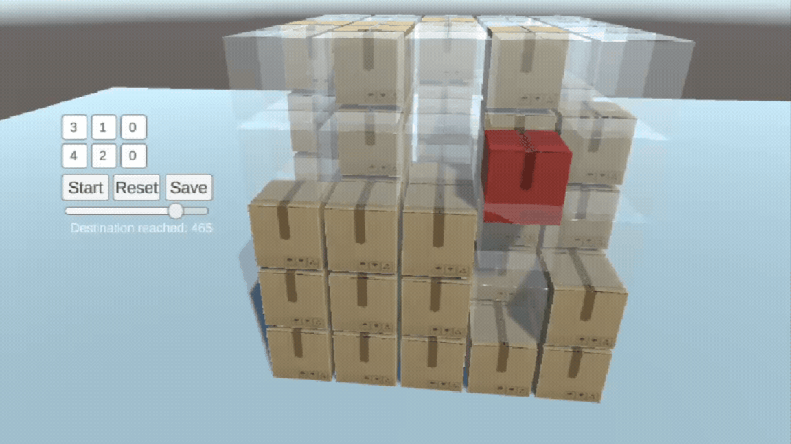

# Q Learning Release Notes 22.03.2024

- [Q Learning Release Notes 22.03.2024](#q-learning-release-notes-22032024)
- [Changes in Stage 1](#changes-in-stage-1)
  - [Explanations of Adjustments](#explanations-of-adjustments)
    - [Descent Penalty Change](#descent-penalty-change)
    - [Penalty for Revisiting Past States Change](#penalty-for-revisiting-past-states-change)
    - [Ascending Reward Change](#ascending-reward-change)
    - [Penalty for Each Step Change](#penalty-for-each-step-change)
  - [Result of Changes in Stage 1](#result-of-changes-in-stage-1)

# Changes in Stage 1
Refresher: In stage 1, the objective is for a single box to reach a specified point within a 3D grid, following predefined rules, and achieving the goal in the shortest time possible. The Q-table utilized for this stage contains a mapping of states to actions, where each state represents a position within the grid, and each action corresponds to a move the box can make.

The primary objective for the single box in this environment is to ascend to the highest plane and subsequently navigate to the desired column for descent. To ensure optimal performance and adherence to this goal, we  balanced and fine-tuned the reward system. These adjustments were carefully implemented to encourage behaviors that align with the desired outcome while discouraging deviations. Detailed explanations for each modification will be provided later in the documentation, shedding light on the logic behind our decisions and how they contribute to achieving the overarching objective.

| Reward                                | Description                                                                                           | Old Value | New Value | Other Changes           |
|---------------------------------------|-------------------------------------------------------------------------------------------------------|------------|------------|--------------------------|
| Penalty for Each Step                 | A small penalty applied for each move to discourage unnecessary movements.                            | -0.05      | **-0.22**      | -                        |
| Goal Achievement Reward               | The reward received if the box reaches the target point successfully.                                  | 0.2        | 0.2        | -                        |
| Penalty for Inability to Move         | Penalty received when the box cannot move due to obstacles or restrictions.                           | -0.5       | -0.5       | -                        |
| [Ascending Reward](#ascending-reward-change)                      | Reward for successfully ascending while aligning with the x and z coordinates of the starting point. | 1.25       | **1.75**       | -                        |
| [Descent Penalty](#descent-penalty-change)                       | Penalty for descending into a column different from the target x and z coordinates.                   | -2.25      | -2.25      | Removed: Gamma value is not changed anymore.      |
| Penalty for Moving in the Wrong Direction | Penalty received if the box chooses a direction outside the target column despite being in the target column. | -0.75      | -0.75      | -                        |
| [Penalty for Revisiting Past States](#penalty-for-revisiting-past-states-change)   | Penalty received if the agent revisits a state it has visited within the last 8 moves to prevent repetition of states. | -2.0       | -2.0       | Changed: Buffer size increased from 6 to 8 |

## Explanations of Adjustments

### Descent Penalty Change

The condition of resetting gamma to 0 when the box gets stuck at the top has been removed. Such logic didn't conform to Q-Learning principles, and it was observed that the subsequently defined rewards effectively addressed this sticking issue.

### Penalty for Revisiting Past States Change
The size of the state buffer preventing revisits to previously visited boxes has been increased from 6 to 8. This adjustment was made in response to observed instances of being stuck in loops of size 8, and it anticipates the possibility of developing an algorithm to dynamically adjust the buffer size based on the grid dimensions in the future.

### Ascending Reward Change

In some rare instances, situations arose where the agent reached the target without ascending to the highest plane. To mitigate this issue, the reward for ascending was increased from 1.25 to 1.75. Additionally, this adjustment resolved the fundamental problem of reaching the target adjacent to the agent without ascending. The following video provides visual context for the problem has been solved:

      
      
<em>A demonstration showcasing the problem before it has been solved.</em>

  

### Penalty for Each Step Change

In some cases, the penalty applied for each step remained relatively low compared to the newly introduced rewards, which led to instances where the agent would occasionally opt for longer paths, as demonstrated in the following GIF:

  
  
<em>A demonstration showcasing instances where the penalty for each step was insufficient, leading to suboptimal decision-making by the agent.</em>

To ensure balance with the other rewards, the penalty for each step was increased from 0.05 to 0.22. This adjustment aligns the penalty more effectively with the overall reward system, promoting better decision-making by the agent.

## Result of Changes in Stage 1

Following these adjustments and balancing efforts, no major errors have been observed in Stage 1. The fine-tuning of rewards and penalties has effectively mitigated previous issues, leading to improved performance and stability in the environment.

